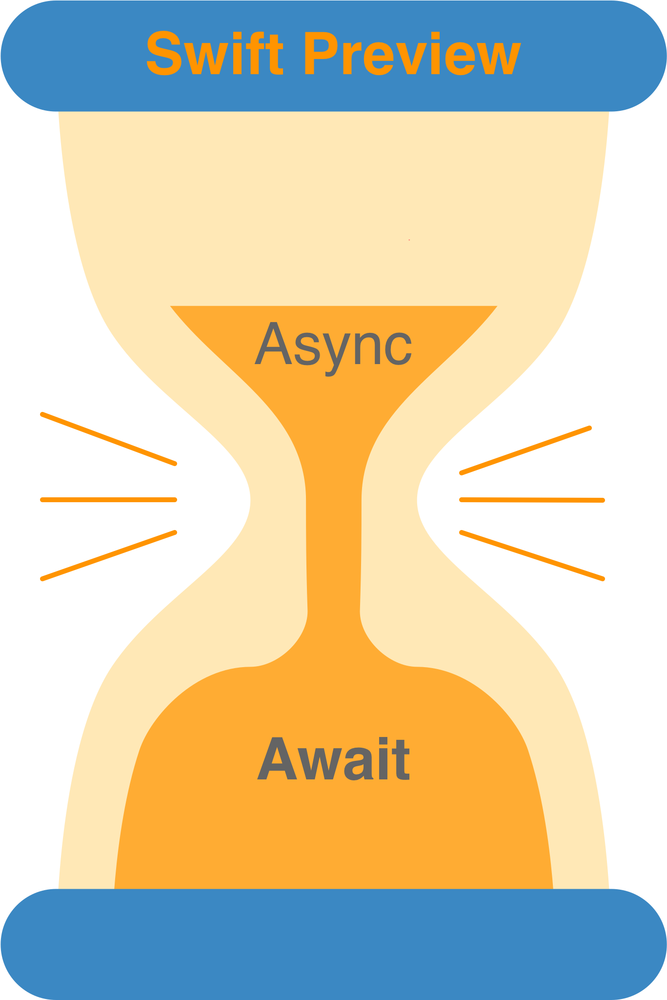

# Async와 Await

2023월 5월 17일 - 강혁



<aside>

🔥 **Async, Await**

---

**기존에 비동기 처리 방식과 다르게 편하게 비동기 처리할 수 있는 문법**

- *기존 코드*
    
    ```swift
    import UIKit
    
    // DispatchQueue 사용한 비동기 처리
    DispatchQueue.global.async {
    
    }
    
    // completionHandler를 사용한 비동기 처리
    let task = URLSession.shared.dataTask(with: url, completionHandler: { 
    		data, 
    		response, 
    		error in
    }).resume()
    ```
    
</aside>

<br>

### 등장 배경 🏝️

---

*간단히 말하면 기존 방식의 단점들이 등장배경이 되었다*

1. **completionBlock 문법**
    
    ```swift
    func processImageData1(completionBlock: (_ result: Image) -> Void) {
        loadWebResource("dataprofile.txt") { dataResource in
            loadWebResource("imagedata.dat") { imageResource in
                decodeImage(dataResource, imageResource) { imageTmp in
                    dewarpAndCleanupImage(imageTmp) { imageResult in
                        completionBlock(imageResult)
                    }
                }
            }
        }
    }
    
    processImageData1 { image in
        display(image)
    }
    ```
    
    - 비동기 작업을 연속적으로 실행해야 하는 경우에 클로저 안에 클로저가 반복되며 코드가 쌓임
2. Error Handling
    
    ```swift
    func processImageData2c(completionBlock: (Result<Image, Error>) -> Void) {
        loadWebResource("dataprofile.txt") { dataResourceResult in
            switch dataResourceResult {
            case .success(let dataResource):
                loadWebResource("imagedata.dat") { imageResourceResult in
                    switch imageResourceResult {
                    case .success(let imageResource):
                        decodeImage(dataResource, imageResource) { imageTmpResult in
                            switch imageTmpResult {
                            case .success(let imageTmp):
                                dewarpAndCleanupImage(imageTmp) { imageResult in
                                    completionBlock(imageResult)
                                }
                            case .failure(let error):
                                completionBlock(.failure(error))
                            }
                        }
                    case .failure(let error):
                        completionBlock(.failure(error))
                    }
                }
            case .failure(let error):
                completionBlock(.failure(error))
            }
        }
    }
    
    processImageData2c { result in
        switch result {
        case .success(let image):
            display(image)
        case .failure(let error):
            display("No image today", error)
        }
    }
    ```
    

*하지만 Async와 Await을 통해 복잡한 코드를 벗어날 수 있다*

```swift
func loadWebResource(_ path: String) async throws -> Resource
func decodeImage(_ r1: Resource, _ r2: Resource) async throws -> Image
func dewarpAndCleanupImage(_ i : Image) async throws -> Image

func processImageData() async throws -> Image {
  let dataResource  = try await loadWebResource("dataprofile.txt")
  let imageResource = try await loadWebResource("imagedata.dat")
  let imageTmp      = try await decodeImage(dataResource, imageResource)
  let imageResult   = try await dewarpAndCleanupImage(imageTmp)
  return imageResult
}
```

<br>

### **🍮 Async, Await를 처리하는 내부 원리**

---


<aside>

⚗️ **Async에서의 스레드 관리**

---

- 🌬️ 호출 : A함수에서 B함수를 호출 → A함수가 실행되던 스레드의 제어권을 B에게 전달
- 🚀 진행 : B함수는 async이기 때문에 스레드의 제어권을 포기하는 suspend 가능
    - *suspend되면 호출한 A함수도 같이 suspend됨*
- 🌊 suspend : 스레드에 대한 제어권은 system으로 감 → 스레드를 사용하여 다른 작업을 수행
- 💨 resume : 일시 중단된 비동기 함수 B를 다시 실행하는 단계
- ☀️ 종료 : B함수가 종료 → A함수에게 스레드 제어권을 반납
</aside>