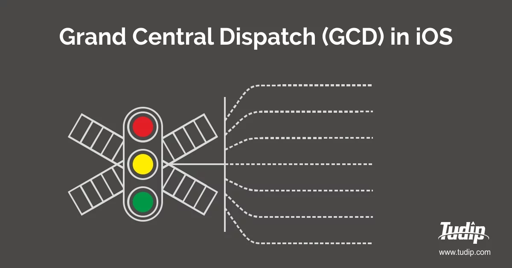
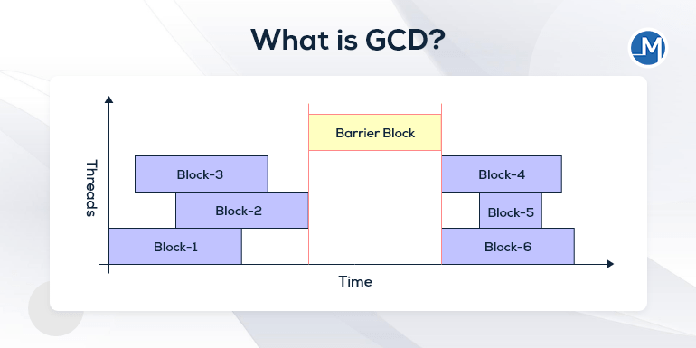

# GCD

2023년 5월 18일 - 강혁



<br>

# 🔥 What is GCD?



<aside>

🍬 **Grand Cetral Dispatch**

---

**멀티코어 시스템에서 동시성 실행을 제공하는 프로그래밍 언어 요소, 런타임 라이브러리 등등**

<br>
</aside>

## 🧪 ****Main Thread / Global Thread****

<br>
<aside>

☀️ **Main Thread**

---

**UI와 관련된 작업이 실행될 때 동작하는 쓰레드**

- 오직 한 개만 존재
- UI와 관련된 작업은 반드시 Main Thread에서 작성
- Main Queue에서 작동 (Serial Queue)
- *Interface Thread 라고도 불림*
</aside>

<br>
<aside>

⛅ **Global Thread**

---

**메인 스레드가 아닌 다른 복수개의 스레드**

- iOS에서의 Framework들은 모두 Background에서 구동 됨
    - 몸체는 Background에 있고 필요할 때 Main Thread에게 손(Delegate)을 뻗는 구조
    - 만약 Framework 작업이 모두 Main Thread에서 작동한다면 앱의 화면은 계속 멈춤
- 자동으로 실행되는 것 외에도 코드 실행이 오래 걸리는 작업은 직접 Background Thread로 실행
- Global Queue에서 작동 (Concurrent Queue)
    - →  여러 스레드로 작업이 분산되어 동시에 처리
- *Background Thread 라고도 불림*
</aside>

<br>

## 🫡 ****NSOperation / GCD****

<br>
<aside>

🌟 **NSOperation**

---

**Objective-C언어 기반의 고수준 API**

- 내부적으로는 C로 구현된 GCD를 고수준 언어로 Wrapping한 것
    - GCD보다 무겁고 약간의 오버헤드를 발생
- GCD엔 없는 기능들을 사용할 수 있음
    - *작업 취소, KVO, 작업 재사용 등등*
- 작업 단위인 NSOperation을 NSOperationQueue에 추가하여 실행 및 동작
    - Concurrent Queue
</aside>

<br>
<aside>

✨ ****Grand Central Dispatch****

---

**C언어 기반의 저수준 API**

- NSOperation보다 가볍고 성능면에서 좋음
- Block(Closure)로 구현되어 있어 코드 가독성면에서 좋고 간단하게 사용가능
- Dispatch Queue라는 것을 사용해서 Multi Threading을 지원
</aside>

<br>

## 🔍 ****DIspatch Queue****

<br>
<aside>

🔭 ****DIspatch Queue****

---

**GCD에선 이 Dispatch Queue라는 것을 이용해 작업을 관리**

*Dispatch Queue는 크게 Main Queue와 Global Queue로 나뉨*

</aside>

> 🎉 **Main Queue (Serial Queue)**
> 
> 
> ---
> 
> - UI 관련 작업은 이곳에서 처리
> - Main Queue에는 절대 절대 Sync Task를 추가할 수 없음
>     - Thread-Safe하지 않기 때문
> - Task들을 순차적으로 처리 → 한 번에 한 개의 Task 밖에 처리하지 못함

> 🎊 **Global Queue (Concurrent Queue)**
> 
> 
> ---
> 
> - Qos 지원
>     - Qos = Priority(우선 순위)
>     - 이 우선 순위를 우리가 직접 명시 가능
>     - Qos를 딱히 지정하지 않으면 .Default로 지정
>     - Qos를 잘 활용하면 에너지 효율성이 좋아짐
>     - *만약, Qos를 지정하고 싶다면 아래와 같이 지정*
>         
>         ```swift
>         DispatchQueue.global(qos: .userInteractive).sync {
>             //원하는 작업
>         }
>         ```
>         
> - sync, async를 지정해서 호출해주면 됨
> - 동시에 여러 개의 Task들을 처리함

*이외에도 직접 Queue를 만들 수 있음*

<br>

## 🪄 Custom Queue

<br>
<aside>

🍮 **사용자 지정 큐**

---

**어떤 특성의 큐로 Dispatch Queue를 생성할지 Custom한 Queue**

```swift
let myQueue = DispatchQueue.init(label: "myQueue", qos: .background attributes: .concurrent)

myQueue.async {
    //원하는 작업
}
```

- 기본값으로는 Serial을 가지고있지만, Concurrent로 변경 **O**
- Qos 적용 **O**
- *Private Queue, Custom Queue등으로 불림*
</aside>