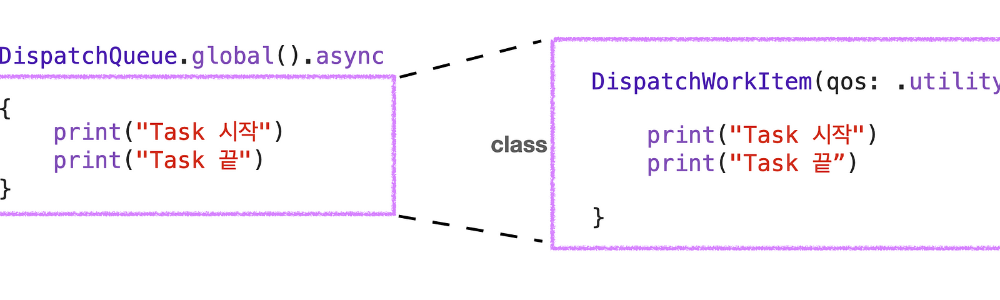

# DispatchWorkItem, DispatchGroup


2023년 6월 1일 - 강혁

<br>

### DispatchWorkItem 🎡

---



<aside>

💡 **개요**

---

**Dispatch Queue 또는 Dispatch Group 내에서 수행할 task 캡슐화**

- DispatchSource 이벤트, 등록 또는 취소 handler로 사용할 수 있음
- task를 세분화하여 만들어두고 DispatchQueue로 실행
- class 내부에 DispatchWorkItemFlags라는 struct 존재
    
    →  QoS 지정 가능
    
</aside>

```swift
//example
let myQueue = DispatchQueue(label: "com.nil.queue")

let workItem = DispatchWorkItem {
   print("WorkItem task")
}
// DispatchWorkItem의 생성은 Clouser 형태로 위처럼 생성

myQueue.async(execute: workItem)
// 실제 Queue에서 실행
```

- 결과
    
    WorkItem task
    

*DispatchWorkItem의 method 중에 perform()을 이용하여 실행 가능*

```swift
//example
let myQueue = DispatchQueue(label: "com.nil.queue")

let workItem = DispatchWorkItem {
   print("WorkItem task")
}

workItem.perform()
// work item block을 동기적으로 현재 스레드에서 실행
```

- 결과
    
    WorkItem task
    

*Group, Notify도 가능*

```swift
let myGroup = DispatchGroup()

let myQueue = DispatchQueue(label: "com.nil.queue", attributes: .concurrent)

let workItem = DispatchWorkItem {
   sleep(2)
   print("WorkItem task")
}

let workItem2 = DispatchWorkItem {
   print("WorkItme task2")
}

myQueue.async(group: myGroup, execute: workItem)
myQueue.async(group: myGroup, execute: workItem2)

myGroup.notify(queue: .main) {
   print("Notify...")
}
```

- 결과

    WorkItme task2
   
    WorkItem task
    
    Notify...
    
1. *각각의 task를 DispatchWorkItem으로 생성*
2. *.async(group:execute:)로 실행*
3. *.notify로 완료 시점 확인*

<br>
<aside>

🔇 **.cancel()**

---

- **workItem이 queue의 대기열에 있을때 해당 workItem을 건너뜀**
- 이미 실행 중이라면 해당 task 부분에서 isCancelled 값을 확인해서 true이면 종료
</aside>

```swift
let queue = DispatchQueue(label: "dochoi")

let workItem = DispatchWorkItem {
   sleep(2)
   print("WorkItem task")
}

let workItem2 = DispatchWorkItem {
   print("WorkItme task2")
}

queue.async(execute: workItem)
queue.async(execute: workItem2)

workItem2.cancel()
```

- 결과
    
    WorkItem task
    

<br>

### **DispatchGroup 👥**

---

<br>
<aside>

  &nbsp; **DispatchGroup**

---

**DispatchQueue들을 그룹으로 묶어서, 후행 클로저를 처리할 수 있도록 하는 것**

- Task 그룹의 Completion을 다루고 싶을 때 사용
- 다른 성격의 Queue들을 하나의 그룹으로 묶는 것도 가능

```swift
let queue1 = DispatchQueue(label: "queue1", attributes: .concurrent)
let queue2 = DispatchQueue(label: "queue2", attributes: .concurrent)

let group = DispatchGroup()
queue1.async(group: group) {
    for i in 0...5 {
        print(i)
    }
}
queue2.async(group: group) {
    for i in 100...105 {
        print(i)
    }
}

let queueForGroup = DispatchQueue(label: "queue3", attributes: .concurrent)

group.notify(queue: queueForGroup) {
    print("끝")
}
```

- 결과
    
    0

    100

    1

    2

    101

    102

    3

    103

    4

    104

    5

    105

    끝
    
</aside>

```swift
let someQueue = DispatchQueue(label: "queue")
let someOtherQueue = DispatchQueue(label: "otherQueue")
let group = DispatchGroup()

someQueue.async(group: group){  print("1") }
someQueue.async(group: group) { print("2")  }
someOtherQueue.async(group: group) { print("3") }

group.notify(queue: DispatchQueue.main) {
    print("complete")
}
```

- 결과
    
    1

    3

    2

    complete

<br>

**DispatchGroup은 여러 Queue에 있는 Task들과 연결**

- → 모든 Task들에 대한 completion을 notify를 통해 다룰 수 있음
- *(notification은 비동기적이므로, 그룹 내의 Task가 완료되지 않은 경우 Task를 계속 추가할 수 있음)*
- notification을 동기적으로 하고 싶다면 wait 사용
    
    ```swift
    let group = DispatchGroup()
    let queue = DispatchQueue(label: "queue")
    let queue2 = DispatchQueue(label: "queue2")
    let queue3 = DispatchQueue(label: "queue3")
    
    queue.async(group: group){  print("1") }
    
    queue2.async(group: group) { print("2")  }
    
    queue3.async(group: group) { print("3"); sleep(2) }
    
    if group.wait(timeout: .now() + 1) == .timedOut {
      print("The jobs didn’t finish in 1 seconds")
    }
    
    print("complete")
    RunLoop.main.run()
    ```
    
    - 결과
        
        2

        1

        3

        The jobs didn’t finish in 1 seconds

        complete
        
    
    Task가 모두 끝날 때까지 현재 Thread를 차단 (*timeout이 되어도 Task는 취소되지 않고 진행*)