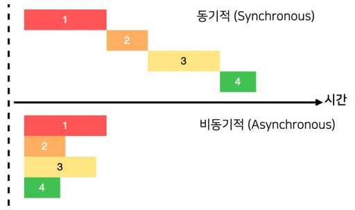
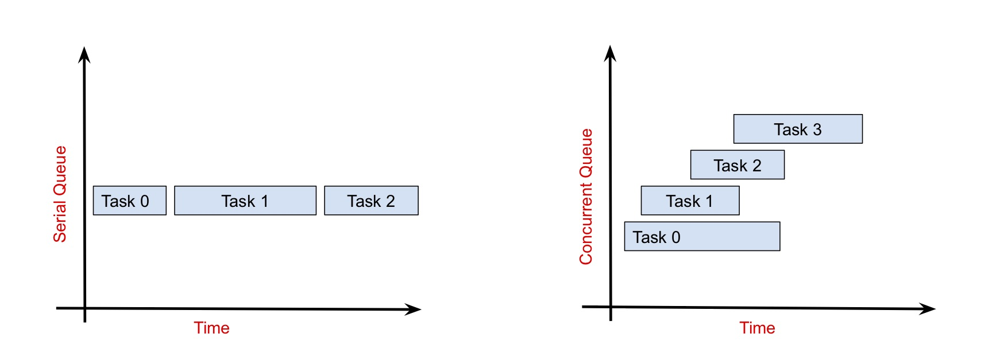

# 동기 / 비동기 / 동시 / 직렬의 차이

2023년 5월 16일

<br>

# 🌀 Sync & Async



<aside>

♻️ **Sync**

---

**동기 : 요청과 응답이 동시에 일어난다**

- 일반적인 코드를 작성하면 작성한 순서대로 호출
- 아무런 세팅을 해놓지 않은 경우 보통 동기로 작업 진행

```swift
func task1() {
    print("task1 start")
    print("task1 end")
}

func task2() {
    print("task2 start")
    print("task2 end")
}

func task3() {
    print("task3 start")
    print("task3 end")
}

task1()
task2()
task3()

/* 출력
* task1 start
* task1 end
* task2 start
* task2 end
* task3 start
* task3 end
*/
```

- 이전의 작업이 아무리 오래걸려도 끝날때까지 다음 작업이 진행 **X**
</aside>

<br>
<aside>

🌧️ **Async**

---

**비동기 : 동기와 반대로 동시에 일어나지 않는 것**

- 요청과 응답이 동시에 일어나지 않아도 됨
- 요청을 하면 응답은 나중에 하거나 아니면 응답이 되지 않을 수도 있음

```swift
import Dispatch

let queue1 = DispatchQueue(label: "1")
let queue2 = DispatchQueue(label: "2")
let queue3 = DispatchQueue(label: "3")

func task1() {
    print("task1 start")
    print("task1 end")
}

func task2() {
    print("task2 start")
    print("task2 end")
}

func task3() {
    print("task3 start")
    print("task3 end")
}

queue1.async {
    task1()

}
queue2.async {
    task2()
}
queue3.async {
    task3()
}

/* 출력
* task1 start
* task2 start
* task3 start
* task1 end
* task2 end
* task3 end
*/
```

- 시간이 얼마나 걸리든 동시에 시작을 하고 작업이 빠른 순으로 끝남
</aside>

*하지만 아래와 같은 코드를 작성하면 비동기도 동기처럼 작동합니다*

```swift
import Dispatch

func task1() {
    print("task1 start")
    print("task1 end")
}

func task2() {
    print("task2 start")
    print("task2 end")
}

func task3() {
    print("task3 start")
    print("task3 end")
}

DispatchQueue.main.async {
    task1()
}

DispatchQueue.main.async {
    task2()
}

DispatchQueue.main.async {
    task3()
}

/* 출력
* task1 start
* task1 end
* task2 start
* task2 end
* task3 start
* task3 end
*/
```

*보통의 경우 큐가 **직렬**로 설정되어 있기 때문에 위와 같은 결과가 나옵니다*

<br>

# 💦 **Serial & Concurrent**



<aside>

⚡ **Serial**

---

**직렬 : 순차적으로 진행**

*그러면 직렬이 동기고 병렬이 비동기 아닌가? 라고 생각할 수 있다
하지만 순차적으로 진행한다는 말은 "작업"들을 얘기한다 따라서 동기, 비동기 둘다 가능하다*

```swift
import Dispatch

func task1() {
    print("task1 start")
    print("task1 end")
}

func task2() {
    print("task2 start")
    print("task2 end")
}

func task3() {
    print("task3 start")
    print("task3 end")
}

DispatchQueue.main.async {
    task1()
}

DispatchQueue.main.async {
    task2()
}

DispatchQueue.main.async {
    task3()
}

/* 출력
* task1 start
* task1 end
* task2 start
* task2 end
* task3 start
* task3 end
*/
```

- 위 코드는 한 큐에 작업을 담았기 때문에 비동기여도 작업을 차례로 수행해서 동기처럼 보임
- 큐안에 있는 작업들을 뜻하는 것이지 다른 쓰레드에 실행되는 작업을 의미하는 것은 아님

```swift
import Dispatch

let queue1 = DispatchQueue(label: "1")
let queue2 = DispatchQueue(label: "2")
let queue3 = DispatchQueue(label: "3")

func task1() {
    print("task1 start")
    print("task1 end")
}

func task2() {
    print("task2 start")
    print("task2 end")
}

func task3() {
    print("task3 start")
    print("task3 end")
}

queue1.async {
    task1()

}
queue2.async {
    task2()
}
queue3.async {
    task3()
}

/* 출력
* task1 start
* task2 start
* task3 start
* task1 end
* task2 end
* task3 end
*/
```

- 하지만 이와 같은 코드는 서로 다른 큐에 다른 쓰레드로 동작하여 모두 한번에 시작할 수 있음
</aside>

<br>
<aside>

⛈️ **Concurrent**

---

**동시 : 말그대로 동시에 작업을 진행**

```swift
import Dispatch

let concurrentQueue = DispatchQueue(label: "1", attributes: .concurrent)

func task1() {
    print("task1 start")
    print("task1 end")
}

func task2() {
    print("task2 start")
    print("task2 end")
}

func task3() {
    print("task3 start")
    print("task3 end")
}

concurrentQueue.async {
    task1()
}

concurrentQueue.async {
    task2()
}

concurrentQueue.async {
    task1()
}

/* 출력
* task1 start
* task2 start
* task3 start
* task1 end
* task2 end
* task3 end
*/
```

- 위코드는 큐 안에 있는 작업들을 동시에 실행

*그렇다면 동시큐에 동기로 작업을 넣으면 어떻게 될까?*

```swift
import Dispatch

let concurrentQueue = DispatchQueue(label: "1", attributes: .concurrent)

func task1() {
    print("task1 start")
    print("task1 end")
}

func task2() {
    print("task2 start")
    print("task2 end")
}

func task3() {
    print("task3 start")
    print("task3 end")
}

concurrentQueue.sync {
    task1()
}

concurrentQueue.sync {
    task2()
}

concurrentQueue.sync {
    task3()
}

/* 출력
* task1 start
* task1 end
* task2 start
* task2 end
* task3 start
* task3 end
*/
```

*비동기든 동기든 둘다 동시에 큐의 작업을 실행하기에 같은 출력이 나올줄 알았지만 아니었다*

*비록 동시 큐라 하더라도 완전한 동시는 존재하지 않으며 
task1이 실행될 때 동기이기 때문에  task1이 끝날 떄까지 인터럽트가 걸려서 동기로 처리되는 것 같다*

</aside>