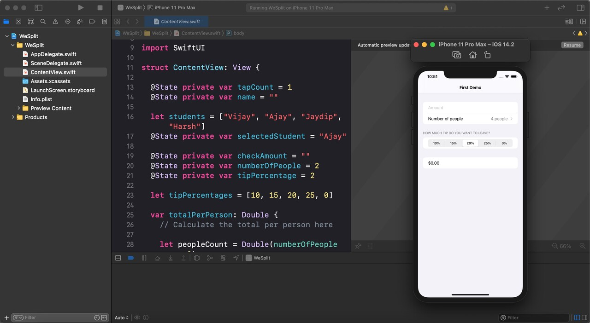

# Swift

Swift

---

**안전, 성능을 고려한 범용 iOS, macOS, watchOS, tvOS Native 프로그래밍 언어**

*공식 홈페이지에 따르면 스위프트의 특징은 다음과 같다*

- 함수 포인터와 통합된 `클로저`
- 튜플과 `다중 반환` 값
- 제네릭
- 범위나 컬렉션에 대한 빠르고 `간결`한 반복
- 방법, 확장 및 `프로토콜`을 지원하는 구조
- `함수형` 프로그래밍 패턴
- 강력한 오류 처리 내장
- `do`, `guard`, `defer` 및 `repeat` 키워드를 사용한 고급 제어 흐름

 

> **등장 배경 🖼️**
> 
> 
> ---
> 
> 1. NeXT STEP이 스티브 잡스와 함께 애플로 이적하게됨
> 2. NeXT STEP를 바탕으로 Mac OS X가 만들어짐
> 3. “Objective-C → NeXT STEP → Mac OS X”의 관계가 성립됨
> 4. 따라서 “Mac OS X도 Objective-C 프로그램을 만들어 움직인다”가 전제였다
> 5. Objective-C 와는 다른 배우기 쉽고 알기 쉬운 사용하기 쉬운 언어가 필요해짐
</aside>

 

📡 **Protocol-Oriented Language**

---

<aside>

**필요한 부분만을 프로토콜로 분리하여 프로그래밍 하는 것**

- 값 타입인 구조체를 참조 타입인 클래스처럼 효율적으로 사용하여 오류 **↓**
- 프로토콜에 익스텐션을 사용하여 더 나은 메커니즘을 구현 **O**

*스위프트의 기본 타입들이 클래스가 아닌 구조체 형태로 되어있음에도 
많은 기능을 구현할 수 있게 해주는 것은 프로토콜이다*

</aside>