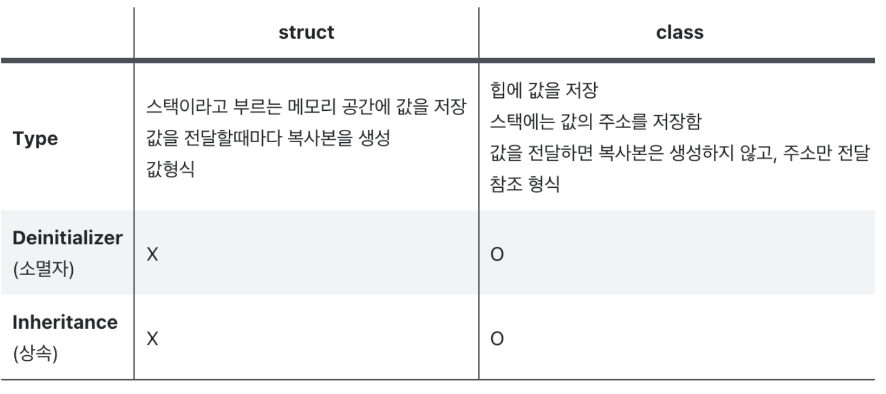

# Swift Class와 Structe비교



<aside>

🪄 **공통점**

---

- 값을 저장하기 위한 프로퍼티 정의
- 기능을 제공하기 위한 메소드 정의
- `subscript` 문법을 이용해 특정 값을 접근할 수 있는 `subscript` 정의
- 초기 상태를 설정할 수 있는 `initializer` 정의
- 특정한 종류의 표준 기능을 제공하기 위한 프로토콜 순응(conform)
</aside>
<br>

## 차이점 ⚗️

<br>
<aside>

🔥 **클래스만 가능한 기능**

---

- 🏆 Inheritance : 싱속
- 🥘 Type casting : 런타임에 클래스 인스턴스의 타입을 확인
- 🍮 Deinitializers : 할당된 자원을 해제(free up) 시킴
- 📮 Reference counting : 클래스 인스턴스에 하나 이상의 참조가 가능
</aside>

<br>

### Definition Syntax 🍨

---

```swift
class SomeClass {
    // 클래스 내용은 여기에
}
struct SomeStructure {
    // 구조체 내용은 여기에
}
```
<br>

### Class and Structure Instances 🦐

---

```swift
let someResolution = Resolution()    // 구조체 인스턴스 생성
let someVideoMode = VideoMode()    // 클래스 인스턴스 생성
```
<br>

### Accessing Properties 🐬

---

다음과 같이 구조체와 클래스를 선언 했다고 해주자

```swift
struct SomeStructure {
		var num = 0
}
class SomeClass {
    var someStructure = SomeStructure()  // 위 Resolution 구조체를 값으로 사용
    var frameRate = 0.0
    var name: String?
}
```

dot(.) 문법을 통해 클래스/구조체 인스턴스의 프로퍼티에 접근할 수 있습니다.

```swift
print("The num of someStructure is \(someStructure.num)")
// "The num of someStructure is 0"이 출력
```

하위레벨 프로퍼티도 점(.)문법을 이용해 접근할 수 있습니다.

```swift
print("The num of someClass is \(someClass.someStructure.num)")
// "The num of someClass is 0"이 출력
```

점문법을 이용해 값을 할당할 수 있습니다.

```swift
someClass.someStructure.num = 1280
print("The num of someClass is now \(someClass.someStructure.num)")
// "The num of someClass is now 1280"이 출력
```

> Objective-C와 다르게 Swift에서는 하위레벨의 구조체 프로퍼티도 직접 설정 **O**
> 
> 
> 위  `someClass.someStructure.num = 1280`처럼 someStructure 전체 값 설정
> 
<br>

### Memberwise Initializers for Structure Types 🎻

---

```swift
let st = SomeStructure(num: 640)
```
<br>

### Structures and Enumerations Are Value Types 🍳

---

```swift
let hd = SomeStructure(num: 640)
var someOne = hd
```

순간 복사(copy)되기 때문에 someOne와 hd는 같지 않고 완전히 다른 인스턴스

```swift
someOne.num = 2048
print("someOne is now \(csomeOne.num)")
// "someOne is now 2048" 출력
```

하지만 원본이었던 `hd`의 `num`값은 여전히 원래 값

```swift
print("hd is still \(hd.num)")
// "hd is still 640" 출력
```

이는 열거형도 마찬가지 입니다

<br>

### Classes Are Reference Types 🐙

---

변수나 상수에 값을 할당을 하거나 함수에 인자로 전달할 때 그 값이 복사되지 않고 참조

```swift
let someData = SomeClass()
someData.someStructure = SomeStructure()  // 위 Resolution 구조체를 값으로 사용
someData.frameRate = 0.0
someData.name: String?

let alsoSomeData = tenEighty
alsoSomeData.frameRate = 30.0

print("The frameRate property of someData is now \(someData.frameRate)")
// "The frameRate property of someData is now 30.0" 출력
```