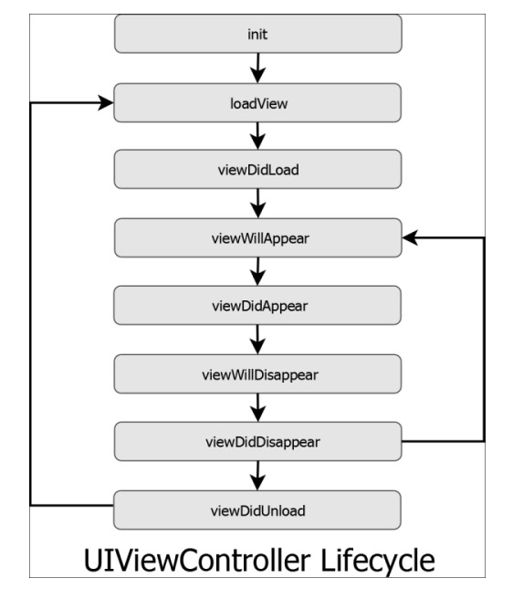

# View Life Cycle

<aside>
 

♾️ **뷰 생명주기**

---

**뷰 컨트롤러의 생명주기를 뜻하는 것으로 뷰가 보여졌다 사라지는 주기**

*결론적으로 뷰는 위와 같은 생명주기를 가진다*

- 생명주기는 순환됨
</aside>

 
<aside>

🍖 **init**

---

**initializer의 준말로 초기화 즉, 초기값 셋팅을 말함**

</aside>

<aside>
 

🥩 **loadView**

---

**컨트롤러가 관리하는 뷰를 '만드는' 역할**

- 이 메서드를 직접 호출 **X**
    - self.loadView()처럼 직접 호출하면 안되지만 오버라이딩 자체는 **O**
- *super.loadView()를 호출해야함*
- 뷰를 만들고 메모리에 올림
</aside>

<aside>
 

🦀 **viewDidLoad**

---

**뷰가 로드 되었다**

- 뷰의 컨트롤러가 메모리에 로드되고 난 후에 호출됨
- 로딩이 완료된 후 시스템에 의해 자동으로 호출
    - 리소스를 초기화하거나 초기 화면을 구성하는 용도
- 화면이 처음 만들어질 때 한 번만 실행
</aside>

<aside> 

🍮 **viewWillApper**

---

**뷰가 나타날 것이다**

- 뷰가 이제 나타날 거라는 신호를 컨트롤러에게 알리는 역할
- viewDidLoad와 달리 다른 뷰에서 다시 돌아올 때도 실행
</aside>

<aside> 

🦐 **viewDidApper**

---

**뷰가 나타났다**

- 뷰가 나타났다는 것을 컨트롤러에게 알리는 역할
- 화면에 적용될 애니메이션을 그려줌
- 뷰가 화면에 나타난 직후에 실행
</aside>
<aside> 

🍭 **viewWillDisapper**

---

**뷰가 사라질 것이다**

- 뷰가 삭제 되려는 것을 뷰 컨트롤러에 알려주는 역할
- 뷰가 사라지기 직전에 호출
</aside>

<aside> 

🦞 **ViewDidUnload**

---

**뷰가 사라졌다**

- 뷰 컨트롤러에 뷰가 제거되었음을 알려주는 역할
- viewWillDisapper 다음에 호출 됨
    - 하지만 다른 뷰가 있을 경우 viewDidLoad, viewWillApper이 먼저 호출됨
</aside>